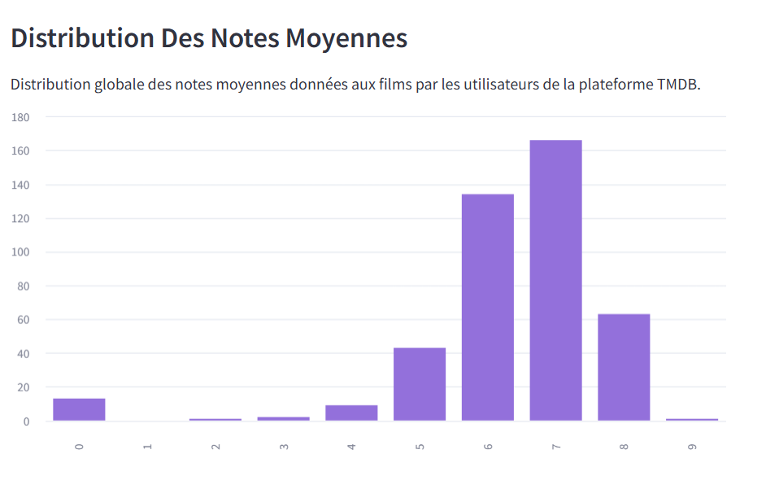
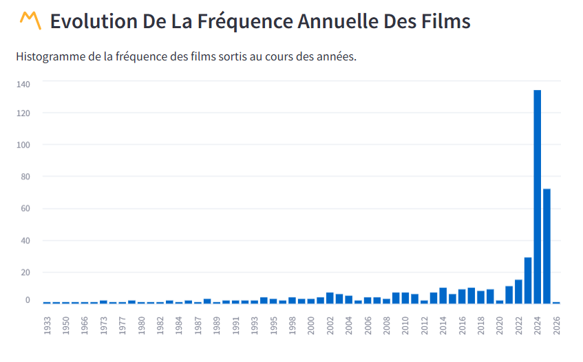
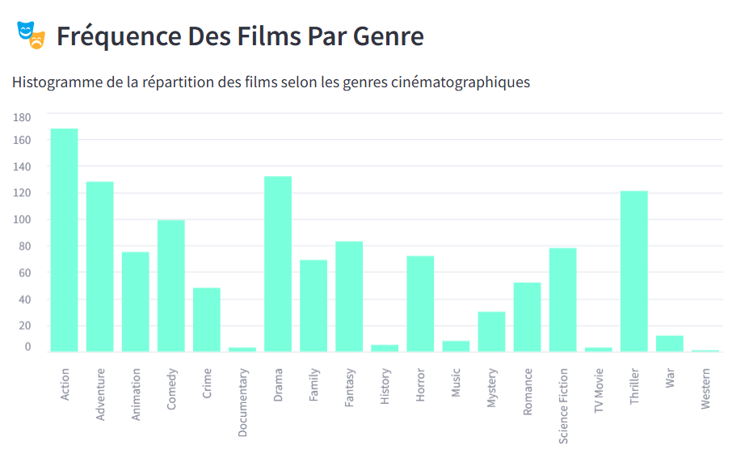
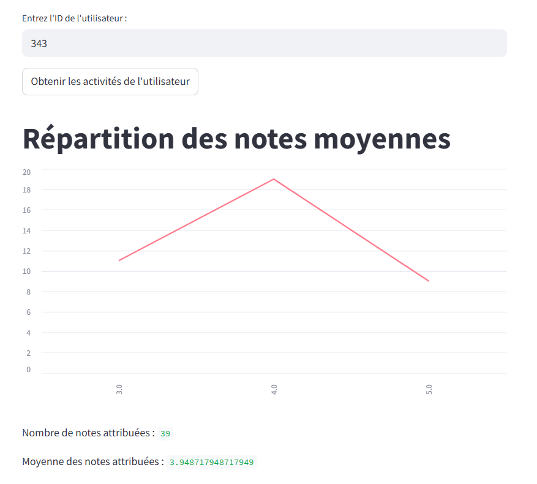
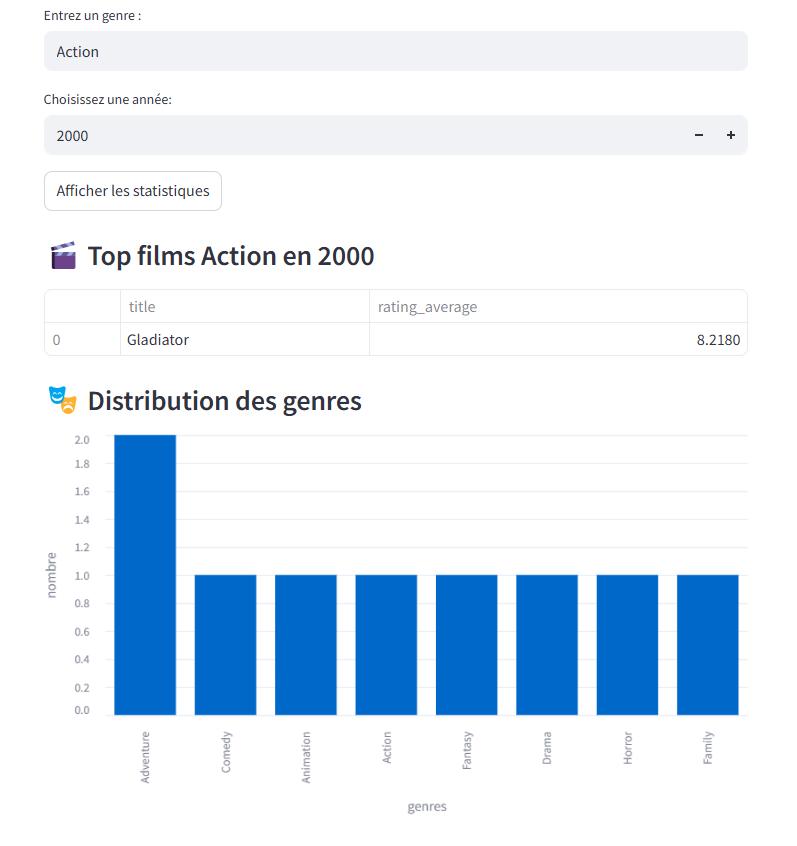
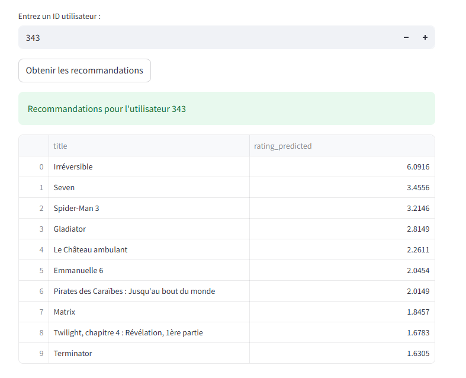

# 🎬📽️ Homeflix : Application de Recommandation de films en ligne


Bienvenue sur Homeflix, une plateforme de recommandation de films basée sur le filtrage collaboratif, développée pour fournir à l'utilisateur une expérience personnalisée à travers l'analyse de données réelles d'autres utilisateurs. Le projet est conteneurisé avec Docker Compose et permet une visualisation interactive via une interface Streamlit.

---
# Sommaire
- [Objectifs du Projet](###Objectifs-du-Projet)
- [Architecture Globale](#Architecture-Globale)
- [Structure du Projet](###Structure-du-Projet)
- [Installation](#Installation)
- [Navigation Dans l'Application](#Navigation-Dans-lApplication)
- [Auteurs](#Auteurs)

---  
# Objectifs du Projet

- Proposer des recommandations de films personnalisées basées sur les goûts similaires d’autres utilisateurs.
- Réaliser ce filtrage collaboratif par utilisation d'un modèle SVD.
- Offrir une visualisation des tendances cinématographiques avec quelques statistiques : dates de sorties, genres, notes attribuées, etc...
- Concevoir une architecture modulaire, et conteneurisée pour faciliter le déploiement de l'application.

---

# Architecture Globale

Le système est divisé en 3 services distincts :


- Base de données (DuckDB) : Stocke les films et les évaluations provenant du site Kaggle et de l'API de TMDB.
- Backend (FastAPI) : Fournit l'API REST et intègre le modèle SVD pour les recommandations.
- Frontend (Streamlit) : Délivre les visualisations graphiques et les sorties de requete au travers de son interface utilisateur.
- Conteneurisation (Docker) : Facilite le déploiement de l'application.
  
 
# Structure du Projet
```
├── backend
|   ├── __init__.py
│   ├── app.py
│   ├── database.py
│   ├── recup_films.py
│   ├── recup_genre.py
│   ├── requirements.txt
│   ├── routes.py
│   └── schema.py
├── data
│   ├── movies.csv
│   ├── movies.db
│   └── ratings.csv
├── frontend
│   ├── dashboard.py
│   └── requirements.txt
|── .gitignore
├── docker-compose.yml
├── Dockerfile.backend
├── Dockerfile.frontend
└── README.md
```
---

# Lancer le Projet


## Installation

Assurez-vous d’avoir Docker et Docker Compose installés sur votre machine.

```bash
# Cloner le dépôt
git clone https://github.com/SraaaaS/Projet-Homeflix.git
cd Projet-Homeflix

# Lancer les services
docker-compose up --build
```

L'application frontend est alors disponible à l'adresse :  
http://localhost:8501

Pour l'API backend se rendre sur :  
http://localhost:8000/docs


## Navigation Dans l'Application

Outre la page d'acceuil, la barre latérale permet de choisir parmi plusieurs sections :

1. **Distribution Des Notes Moyennes**  

    L'histogramme de la distribution globale des notes moyennes données aux films par les utilisateurs de TMDB.  

    
   

3. **Evolution De La Fréquence Annuel Des Films** 

    L'histogramme de la frequence des films sortis selon l'année considérée.  

     
   

4. **Fréquence Des Films Par Genre**  

    L'histogramme de la répartition des films selon les genres cinématographiques considérés.  

     
   

6. **Activité D’un Utilisateur**  
  
    Entrez un id utilisateur : c'est un nombre entre 1 et 1000. En cliquant sur "Obtenir les activités de l'utilisateur" s'affichent:
   - le graphe de la répartion des notes moynnes attribuées par cet utilisateur,
   - le nombre total de notes qu'il a attribué ainsi que
   - la moyenne de ces attributions de notes.  

    
     

7. **Statistiques Par Genre Et Année**  

    Entrez un genre (par exemple Action, Drama, Thriller, Comedy mais le nom de genre doit etre en anglais) et une année (entre 1933 et 2026). Vous obtenez ainsi les meilleurs films pour le genre et l'année choisis mais également la distribution des genres cinématographiques pour l'année demandée.  

    L'API est ici:
        `GET http://backend:8000/statistics/{genre}/{year}`  

      

   
8. **Outils De Recommandations Personnalisées**

    Entrez un ID utilisateur et recevez la liste personnalisée des recommandations de films obtenue par filtrage collaboratif et modèle SVD. Sur cette liste de recommandations figure egalement la prediction des notes que l'utilisateur attribuerait à chacun des films qui lui sont recommandés.  
    
    On utilise ici l'API :
        `POST HTTP://backend:8000/recommandation/{user_id}`

    Dû à la combinaison des fichiers de ratings et de movies, les id d'utilisateurs possibles sont plus restreints.  
      
    Voici une liste non exhaustive d'id valides à tester : `6, 47, 73, 343, 542, 971, 999`.  

     
   


10. **A Propos Du Projet Homeflix**

    Cette partie fournit le détail de l'ensemble des consignes, exigences et attendus requis par l'enseignant pour ce projet de fin d'année de Master.

---
# 👩‍💼Auteurs👨‍💼

Sraaaas :  
https://github.com/SraaaaS

lucawsss :  
https://github.com/lucaswsss
